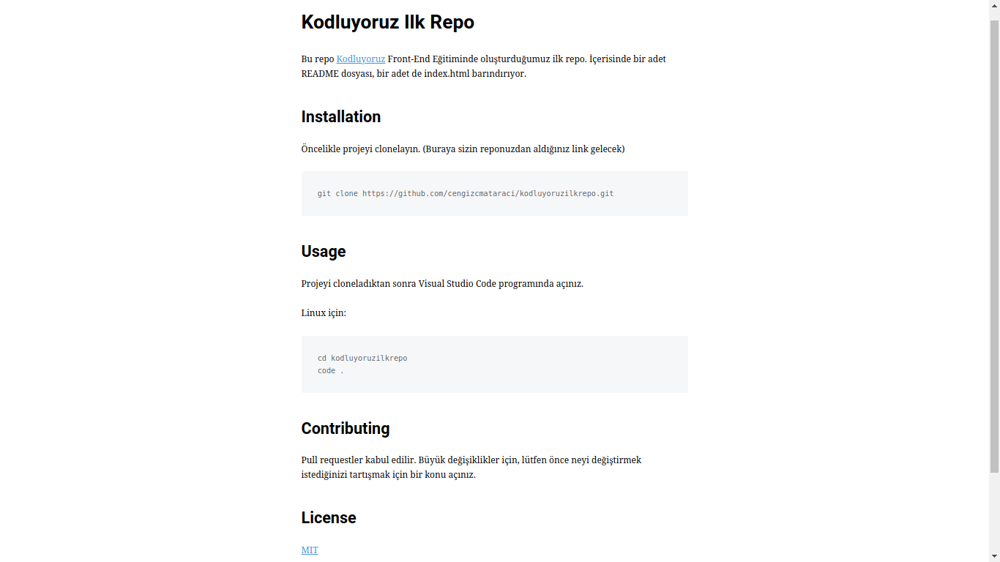

# Kodluyoruz İlk Repo

Bu repo [Kodluyoruz](https://patika.dev) Front-End Eğitiminde oluşturduğumuz ilk repo. İçerisinde bir adet README dosyası, bir adet index.html barındırıyor.



## Installation
---
Öncelikle projeyi clonelayın.
```
https://github.com/gulerburak/kodluyoruzilkrepo.git
```

## Usage
---
Projeyi cloneladıktan sonra Visual Studio Code programında açınız.

Linux için:
```
cd kodluyoruzilkrepo
code .
```

## Contributing
---
Pull requestler kabul edilir. Büyük değişiklikler için, lütfen önce neyi değiştirmek istediğinizi tartışmak için bir konu açınız.

## License
---
[MIT](https://github.com/gulerburak/kodluyoruzilkrepo.git)